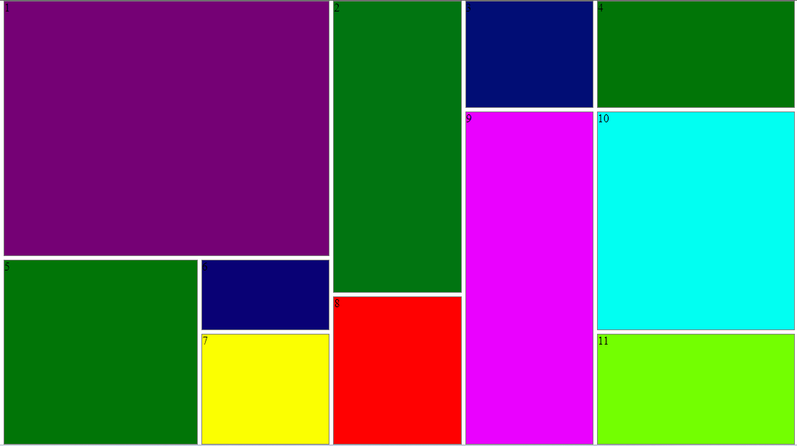

<h2>Layout при помощи CSS Grid</h2>
https://dmitriy-1986.github.io/GridLayout-cssGrid/

  Задаем имена для колонок в свойстве grid-template-columns и имена для строк grid-template-rows, для этого достаточно в квадратных скобках указать имя в repeat(12, [col] 1fr) и  repeat(12, [row] 1fr), а промежуток между колонками и рядами grid-gap 5px.

  Созданным дочерним элементам задаем свойства grid-column и зададим размеры которые он будет занимать grid-column: col 1 / col 4, аналогично можно изменить свойства для grid-row: row 3 / row 9.

